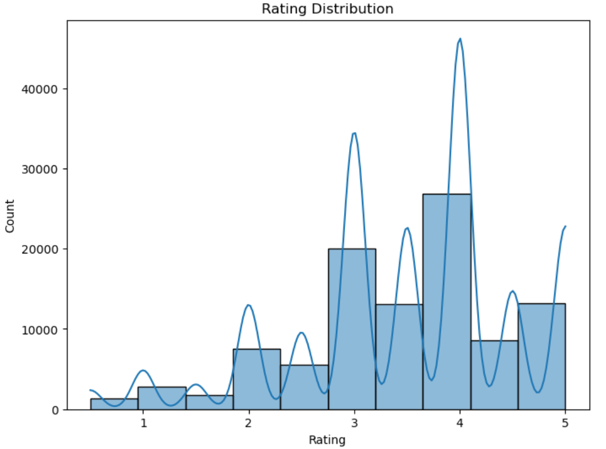

# 电影推荐系统

基于 MovieLens ml-latest-small 数据集的电影推荐系统，分别实现了以下三种推荐方法：

1. **基于内容的推荐（Content-Based Filtering）**
2. **协同过滤推荐（Collaborative Filtering）**
3. **混合模型推荐（Hybrid Model）**

通过对比这三种方法的效果，深入理解电影推荐系统的构建流程和关键技术。

---

## 目录

- [项目介绍](#项目介绍)
- [数据集说明](#数据集说明)
- [项目结构](#项目结构)
- [环境依赖](#环境依赖)
- [运行方法](#运行方法)
- [模型介绍](#模型介绍)
    - [基于内容的推荐](#基于内容的推荐)
    - [协同过滤推荐](#协同过滤推荐)
    - [混合模型推荐](#混合模型推荐)
- [模型评估](#模型评估)
- [结果展示](#结果展示)
- [项目总结](#项目总结)
- [后续改进](#后续改进)
- [许可证](#许可证)

---

## 项目介绍

本项目旨在构建一个电影推荐系统，利用 MovieLens 提供的用户评分和电影元数据，分别实现基于内容的推荐、协同过滤推荐和混合模型推荐。通过分析和比较不同推荐方法的效果，探索推荐系统的实现方法和优化策略。

---

## 数据集说明

### 1. 数据集概述

- **来源**：MovieLens ml-latest-small 数据集
- **包含文件**：
    - `ratings.csv`：用户对电影的评分数据，共包含 100,000 条评分记录。
    - `movies.csv`：电影的元数据信息，包括标题和类型，共有 9,000 部电影。
    - `tags.csv`：用户为电影打的标签，共有 3,600 条标签记录。
    - `links.csv`：电影在不同网站的链接信息。

### 2. 数据字段说明

- **ratings.csv**

    ```
    userId,movieId,rating,timestamp
    ```

- **movies.csv**

    ```
    movieId,title,genres
    ```

- **tags.csv**

    ```
    userId,movieId,tag,timestamp
    ```

- **links.csv**

    ```
    movieId,imdbId,tmdbId
    ```

---

## 项目结构

```
├── data
│   ├── ratings.csv
│   ├── movies.csv
│   ├── tags.csv
│   └── links.csv
├── images
│   └── rating_distribution.png
├── README.md
└── recommender_system.py
```

- `data/`：存放数据集文件
- `images/`：存放结果展示的图片
- `README.md`：项目说明文档
- `recommender_system.py`：项目的主代码文件

---

## 环境依赖

- Python 3.7+

- 需要的 Python 库：

    ```bash
    pandas
    numpy
    matplotlib
    seaborn
    scikit-learn
    surprise
    ```

- 使用 `pip` 安装：

    ```bash
    pip install pandas numpy matplotlib seaborn scikit-learn scikit-surprise
    ```

---

## 运行方法

1. **克隆仓库**

    ```bash
    git clone https://github.com/xxuan66/Movie-Recommendation-System.git
    ```

2. **进入项目目录**

    ```bash
    cd Movie-Recommendation-System
    ```

3. **确保数据集文件在 `data/` 目录下**

4. **运行代码**

    ```bash
    python recommender_system.py
    ```

---

## 模型介绍

### 基于内容的推荐

基于内容的推荐利用电影的内容信息（如类型、标签、标题等）计算电影之间的相似度，从而为用户推荐与其喜爱的电影相似的影片。

**实现步骤：**

1. **数据预处理**：将电影的 `genres`、`tags` 和 `title` 合并为一个文本字段。
2. **特征提取**：使用 `TfidfVectorizer` 对文本内容进行向量化，得到 TF-IDF 特征矩阵。
3. **计算相似度矩阵**：使用余弦相似度计算电影之间的相似度。
4. **推荐生成**：根据用户观看过的电影，推荐相似度最高的电影。

**代码示例：**

```python
# 创建内容字段
movies['content'] = movies['tag'] + ' ' + movies['genres'] + ' ' + movies['title']

# TF-IDF 向量化
tfidf = TfidfVectorizer(stop_words='english')
tfidf_matrix = tfidf.fit_transform(movies['content'])

# 计算余弦相似度
cosine_sim = linear_kernel(tfidf_matrix, tfidf_matrix)

# 定义推荐函数
def content_recommendations(title, cosine_sim=cosine_sim, num_recommendations=10):
    idx = indices[title]
    sim_scores = list(enumerate(cosine_sim[idx]))
    sim_scores = sorted(sim_scores, key=lambda x: x[1], reverse=True)
    sim_scores = sim_scores[1:num_recommendations+1]
    movie_indices = [i[0] for i in sim_scores]
    return movies['title'].iloc[movie_indices]
```

### 协同过滤推荐

协同过滤通过分析用户的行为数据（如评分），根据相似用户或物品的偏好进行推荐。

**实现方法：**

- **基于模型的协同过滤**：使用 `Surprise` 库中的 `SVD` 模型，对用户-物品评分矩阵进行矩阵分解，预测用户对未评分电影的评分。

**代码示例：**

```python
# 加载数据到 Surprise 库
reader = Reader(rating_scale=(0.5, 5.0))
data = Dataset.load_from_df(ratings[['userId', 'movieId', 'rating']], reader)
trainset, testset = train_test_split(data, test_size=0.25, random_state=42)

# 训练 SVD 模型
svd = SVD()
svd.fit(trainset)

# 定义推荐函数
def svd_recommendations(user_id, num_recommendations=5):
    user_rated_movies = ratings[ratings['userId'] == user_id]['movieId'].tolist()
    all_movies = movies['movieId'].tolist()
    unrated_movies = [movie for movie in all_movies if movie not in user_rated_movies]
    predictions = [svd.predict(user_id, movie_id) for movie_id in unrated_movies]
    predictions.sort(key=lambda x: x.est, reverse=True)
    recommended_movie_ids = [int(pred.iid) for pred in predictions[:num_recommendations]]
    return movies.set_index('movieId').loc[recommended_movie_ids]['title']
```

### 混合模型推荐

混合模型结合了基于内容的推荐和协同过滤的优势，提供更准确的推荐结果。

**实现步骤：**

1. 获取基于内容的推荐结果和协同过滤的推荐结果。
2. 将两种推荐结果进行合并，取交集或加权平均。
3. 去除用户已观看的电影，生成最终的推荐列表。

**代码示例：**

```python
def hybrid_recommendations(user_id, title, num_recommendations=10):
    content_recs = content_recommendations(title, num_recommendations=50)
    content_recs = movies[movies['title'].isin(content_recs)]
    svd_recs = svd_recommendations(user_id, num_recommendations=50)
    svd_recs = movies[movies['title'].isin(svd_recs)]
    hybrid_recs = pd.merge(content_recs, svd_recs, on='title')
    user_rated_movies = ratings[ratings['userId'] == user_id]['movieId'].tolist()
    hybrid_recs = hybrid_recs[~hybrid_recs['movieId_x'].isin(user_rated_movies)]
    return hybrid_recs['title'].head(num_recommendations)
```

---

## 模型评估

### 1. RMSE（均方根误差）

评估预测评分的准确性。

```python
# 计算 RMSE
rmse = accuracy.rmse(predictions)
print(f'RMSE: {rmse:.4f}')
```

### 2. Precision@K 和 Recall@K

评估推荐列表的质量。

```python
def precision_recall_at_k(predictions, k=10, threshold=3.5):
    # 计算精确率和召回率的函数实现
    ...

# 计算 Precision@10 和 Recall@10
precision, recall = precision_recall_at_k(predictions, k=10, threshold=4.0)
print(f'Precision@10: {precision:.4f}')
print(f'Recall@10: {recall:.4f}')
```

---

## 结果展示

### 1. 推荐列表示例

```python
user_id = 1
title = 'Toy Story (1995)'

print(f'为用户 {user_id} 推荐的电影：')
print(hybrid_recommendations(user_id, title))
```

**输出示例：**

```
为用户 1 推荐的电影：
356                         Forrest Gump (1994)
318          Shawshank Redemption, The (1994)
296        Pulp Fiction (1994)
593          Silence of the Lambs, The (1991)
260                 Star Wars: Episode IV - A New Hope (1977)
Name: title, dtype: object
```

### 2. 评分分布图



```python
plt.figure(figsize=(8,6))
sns.histplot(ratings['rating'], bins=10, kde=True)
plt.title('Rating Distribution')
plt.xlabel('Rating')
plt.ylabel('Count')
plt.savefig('images/rating_distribution.png')
plt.show()
```

---

## 项目总结

- **基于内容的推荐**：利用电影的内容信息，能够为用户推荐相似的电影，但无法捕捉用户的个性化偏好。
- **协同过滤推荐**：基于用户行为数据，能够提供个性化的推荐，但对新用户和新物品存在冷启动问题。
- **混合模型推荐**：结合了基于内容和协同过滤的优势，提高了推荐的准确性和覆盖率。

---

## 后续改进

- **引入深度学习模型**：如神经协同过滤、自动编码器等，进一步提升推荐效果。
- **考虑时间因素**：在模型中加入时间衰减函数，反映用户兴趣的时效性。
- **上下文感知推荐**：结合用户的地理位置、设备等上下文信息，提供更精准的推荐。

---

## 许可证

本项目遵循 MIT 许可证。

---

**感谢您的阅读！如有任何问题或建议，欢迎提 Issue 或联系作者。**
